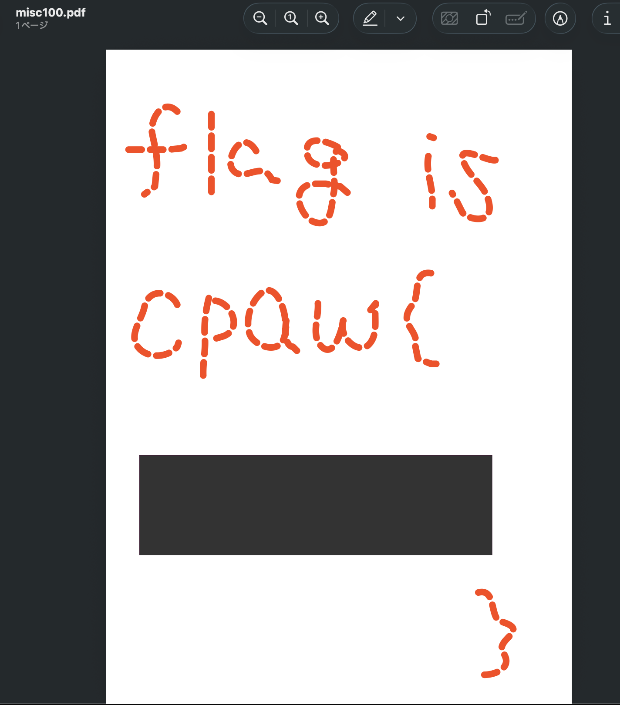

# 問題url

https://ctf.cpaw.site/questions.php?qnum=19

# 問題文

Find the flag in this zip file.

# writeup

zipファイルの解凍をするためにいつも通りファイルをダブルクリックすると、`misc100.zipを展開できません。対応していないフォーマットです。` と注意が。

```bash
exiftool misc100.zip
```

出力結果

```bash
# 中略
File Type                       : ODG
```

「odgファイル」でGoogle検索すると、pdf変換がありそう。

-> 「odgファイル pdf変換」でGoogle検索。pdf変換してもらう。



黒い部分をドラッグしてコピー、VSCodeでペーストするとflagをゲットです。
