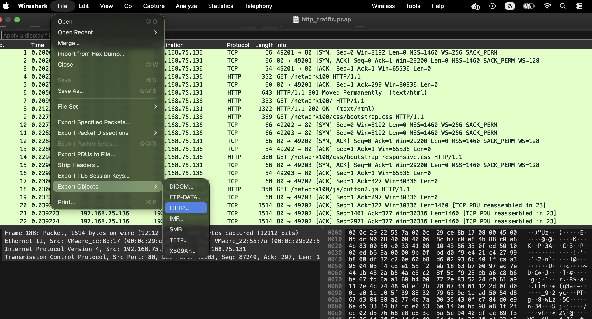
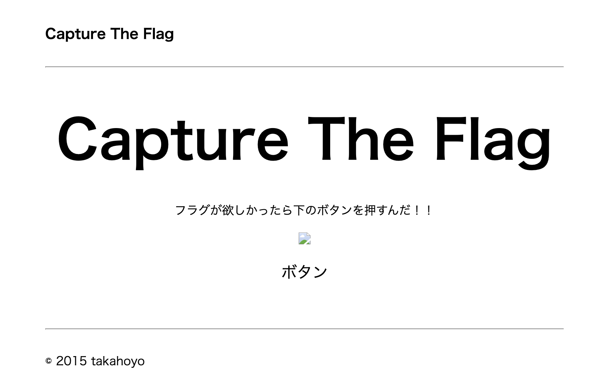

# 問題url

https://ctf.cpaw.site/questions.php?qnum=16

# 問題文

HTTPはWebページを閲覧する時に使われるネットワークプロトコルである。
ここに、とあるWebページを見た時のパケットキャプチャファイルがある。
このファイルから、見ていたページを復元して欲しい。

# writeup

Wiresharkでpcapファイルを開く

fileタブ -> Export Objects -> HTTPS を選択してエクスポートする。



エクスポート先はどこでも。

私のVSCodeには拡張機能Go Liveが入っているので、これを使ってhtmlを表示してみる。



画像がうまく反映されていない。


```html
<!-- 63行目を抜粋 -->
<p></p>

```

imgフォルダの中にimage.jpgが入っていないといけなかったらしいので、imgフォルダを作ってそこに格納する。
他にもcssとjsで同じことが起きているので修正。


ボタンを押すとflagゲットです。
