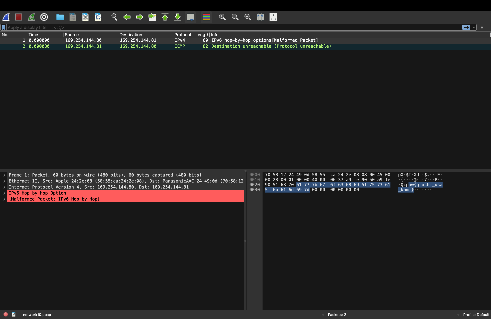

# 問題url

http://ctf.cpaw.site/questions.php?qnum=11

# 問題文

ネットワークを流れているデータはパケットというデータの塊です。
それを保存したのがpcapファイルです。
pcapファイルを開いて、ネットワークにふれてみましょう！

# writeup 1/2

```bash
(venv) ~/ctf% cat network10.pcap 
```

出力結果

```bash
�ò�3��Uq
XU�E(@7���P���Qcpaw{gochi_usa_kami}3��U^q
E�Ds@�D���Q���P�E(@7���P���Qcpaw{gochi_usa_kami}%    
```

解くだけならこれでflagゲットできちゃったんんですが、多分違うので正攻法で解きに行きます。

# writeup 2/2

pcapファイルについて調べるとwiresharkを入れたほうがいいとのことでした。このパソコンには入っていないのでインストールします (https://www.wireshark.org/)。


wiresharkで見てみると、flagを発見です。



