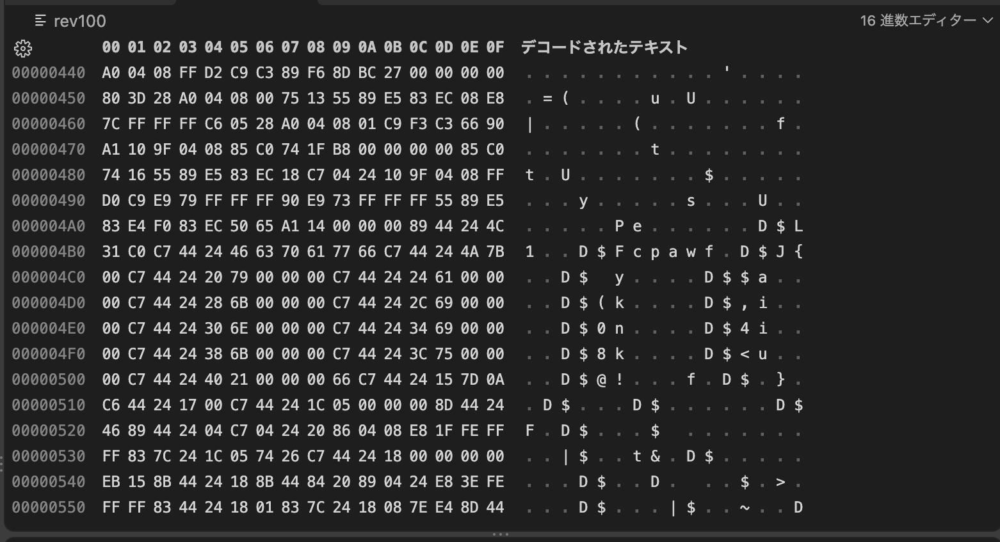

# 問題url

https://ctf.cpaw.site/questions.php?qnum=21

# 問題文

フラグを出す実行ファイルがあるのだが、プログラム(elfファイル)作成者が出力する関数を書き忘れてしまったらしい…

# writeup
VSCodeでHex Editorという拡張機能を入れていると、バイナリを見ることができる。

ちょっと目を凝らすとflagが見えるので、それを入力してACです。
